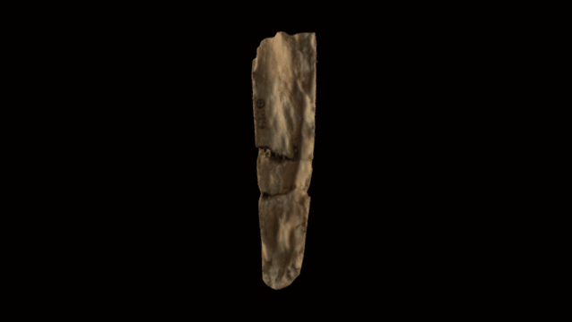

 

# A 3D model of Cuneiform tablet: k.4330

Library of Ashurbanipal: Fragment of a clay tablet, trilingual list, 34 + 29 + 22 lines of inscription. Neo-Assyrian.

Length: 13.33 centimetres Width: 6.66 centimetres Thickness: 3.17 centimetres

COL: K.4330

Made from 146 images taken with a Nikon D5100 by Terhi Nurmikko-Fuller, assembled by Daniel Pett in Photoscan. An experiment, not perfect.

# LICENSE
The contents of this repository are licensed under CC-BY-NC-SA

# Credits
Photographs by Terhi Nurmikko-Fuller (ANU) and models by Daniel Pett <dpett@britishmuseum.org>, Digital Humanities Lead, British Museum
